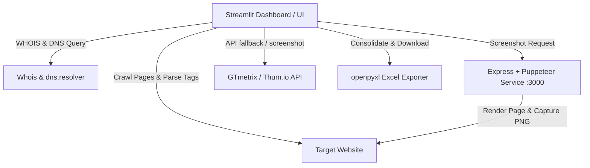

# 🌐 Domain Intelligence Agent & SEO Auditor

[](https://streamlit.io/)
[](https://nodejs.org/)
[](https://pptr.dev/)
[](https://www.python.org/)
[](https://opensource.org/licenses/MIT)

An enterprise-grade, multi-website SEO Auditor and Domain Intelligence Tool. This application combines a fast Python-based crawler with an Express/Puppeteer screenshot microservice, rendering an interactive, glassmorphic Streamlit dashboard for real-time diagnostics and comprehensive Excel reporting.

---

## 🚀 Key Features

*   **Multi-Domain Crawling:** Audit single or multiple target domains simultaneously.
*   **Deep SEO Crawler:** Evaluates on-page SEO factors (Titles, Metas, H1, Canonical tags, OpenGraph tags, JSON-LD Schema structure) and calculates internal/external link profiles.
*   **Domain Intelligence Analytics:** Automatically resolves WHOIS data, nameservers, registrar creation/expiration dates, DNS MX records, and verifies SSL status.
*   **Premium Visual Previews:** Captures live website screenshots via a local Puppeteer microservice, falling back to Thum.io or integrating directly with the **GTmetrix API v2.0**.
*   **Core Web Vitals Simulation:** Calculates simulated Largest Contentful Paint (LCP), First Input Delay (FID), Cumulative Layout Shift (CLS), and Overall Page Speed scores.
*   **Glassmorphic UI Theme:** A custom dark-mode theme styled with custom Google Fonts (`Plus Jakarta Sans`), radial gradients, modern metric cards, and responsive hover effects.
*   **Multi-Sheet Excel Exporter:** Download consolidated Excel workbooks containing domain analytics, crawled pages, technical metrics, and structured SEO recommendations.

---

## 🎨 Premium UI Aesthetics

The application overrides default Streamlit components with a custom, tailored CSS interface:
*   **Typography:** The layout uses the premium `Plus Jakarta Sans` Google Font.
*   **Glassmorphic Panels:** Cards feature blurred backdrops (`backdrop-filter: blur(16px)`), subtle borders, and deep shadows for a high-end feel.
*   **Live Scanning Loader:** When a crawl begins, a custom radial loader and log-stream component render the agent's real-time action telemetry.
*   **Responsive Previews:** Displayed website screenshots are rendered inside mock desktop browser frames.

---

## 📐 System Architecture

The project consists of two core components working together:

1.  **Frontend & Crawl Agent (Python / Streamlit):** Orchestrates the scraping, analyzes elements, performs DNS/WHOIS lookups, and generates final XLSX sheets.
2.  **Screenshot Microservice (Node.js / Puppeteer):** Runs an Express server on port 3000 that spins up a headless Chromium browser to capture the exact layout of the target URL.



---

## 🛠️ Audit Parameters & Rules

The auditor performs multiple checks across every scanned page:

| Category | parameter Checked | Target Threshold | Impact / Action |
| :--- | :--- | :--- | :--- |
| **Technical** | HTTP Status Code | `200 OK` | Reports 4xx client and 5xx server issues. |
| **On-Page SEO** | Title Tag Length | `10 - 65 characters` | Crucial for click-through rate (CTR) optimization. |
| **On-Page SEO** | Meta Description | `50 - 160 characters` | Optimizes search engine snippet presentation. |
| **On-Page SEO** | H1 Headers | `At least one H1 present` | Establishes content hierarchy for indexers. |
| **Technical** | Image Alt Tags | `All images must have alt attributes` | Improves web accessibility and image search SEO. |
| **Performance**| Core Web Vitals | `Simulated LCP < 2.5s, FID < 0.1s` | Identifies layout shifts and performance bottle-necks. |
| **Security** | SSL Validity | `HTTPS with Verified Certificate` | Establishes secure connection trust signals. |
| **Metadata** | Social & Schema | `og:title, og:description, JSON-LD` | Enhances rich-results and social media sharing. |

---

## 📂 Project Structure

```
├── .env.example                # Sample environment variables configuration
├── requirements.txt            # Python third-party dependencies list
├── start.bat                   # Automated Windows startup batch file
├── agent/                      # Core Streamlit app directory
│   ├── app.py                  # Streamlit frontend entrypoint
│   ├── config.py               # Dotenv loader module
│   ├── backend/                # Scraper, WHOIS, DNS, and Excel helper scripts
│   │   ├── crawler.py          # BFS web crawler & SEO validation
│   │   ├── gtmetrix.py         # GTmetrix API runner
│   │   ├── report_generator.py # Excel sheet compiler (openpyxl)
│   │   ├── seo_analyzer.py     # Fallback analyses and mock dataset generator
│   │   └── whois_dns.py        # WHOIS registrar lookup & DNS query handler
│   └── frontend/               # Custom UI stylesheet injects & components
│       ├── components.py       # Render methods for metrics, previews, loaders
│       └── styles.py           # Premium glassmorphic global styling & custom classes
└── screenshot-service/         # Puppeteer screenshot utility
    ├── package.json            # Node.js dependencies
    └── server.js               # Express server running Puppeteer instances
```

---

## ⚡ Setup & Installation

### Prerequisites
*   [Python 3.8+](https://www.python.org/downloads/) installed and added to your `PATH`.
*   [Node.js (v16+)](https://nodejs.org/) installed on your machine.

---

## 🚀 Running the App

Run the startup batch script in your terminal (on Windows):
```bash
.\start.bat
```

This script will automate:
1.  Launching the Node.js/Puppeteer Screenshot Service on `http://localhost:3000`.
2.  Starting the Streamlit dashboard app and launching it in your browser (`http://localhost:8501` by default).

> [!NOTE]
> If you are on Linux or macOS, you can run the services in separate terminal windows:
>
> **Terminal 1 (Screenshot Service):**
> ```bash
> cd screenshot-service && node server.js
> ```
>
> **Terminal 2 (Streamlit Dashboard):**
> ```bash
> cd agent && streamlit run app.py
> ```

---

## 📊 Exported Report Details

The generated download `.xlsx` report contains four specialized tabs:
1.  **Domain_Info:** Domain Registrar details, expiry status, MX Records, Robots/Sitemap discovery, and overall connection checks.
2.  **Crawled_Pages:** Listing of all pages explored with Title, Meta description, H1 headers, and HTTP status codes.
3.  **SEO_Issues:** Full log of detected warnings/critical bugs, mapping the exact URLs, description of issues, severity, and recommended fixes.
4.  **Technical_Audit:** Extended metrics including page load time (seconds), page size (KB), missing image alt tag counts, Schema discovery, canonical status, and simulated LCP/FID/CLS page scores.

---

## 📄 License

Distributed under the MIT License. See `LICENSE` (if applicable) or contact repo owners for details.
